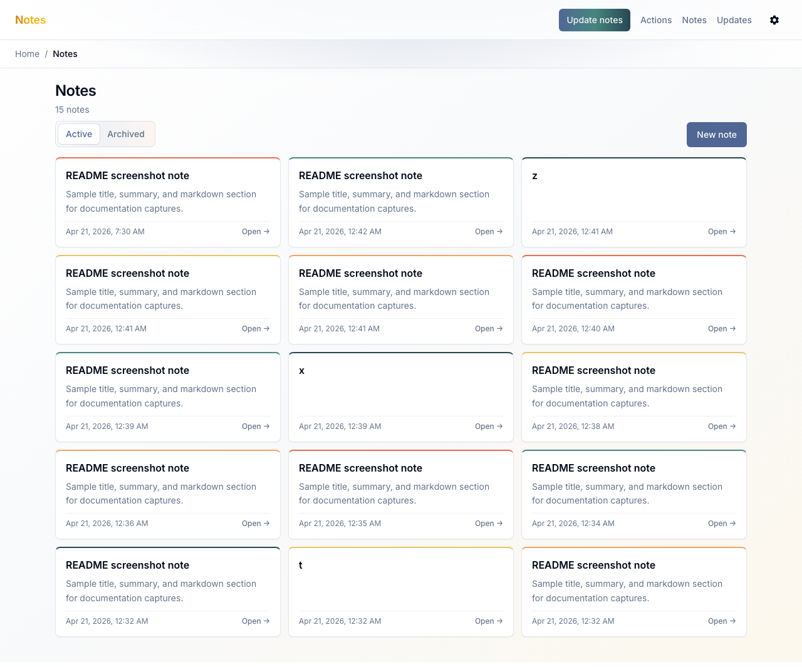
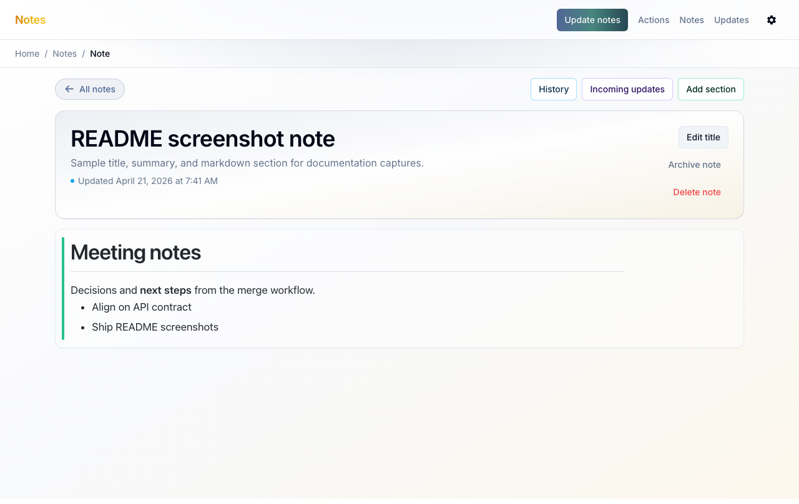
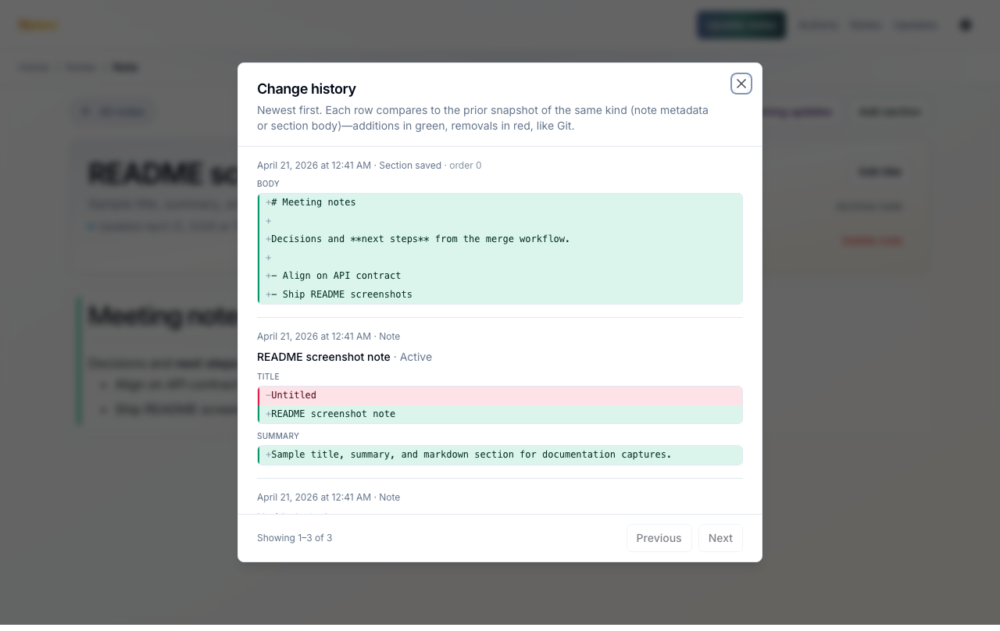
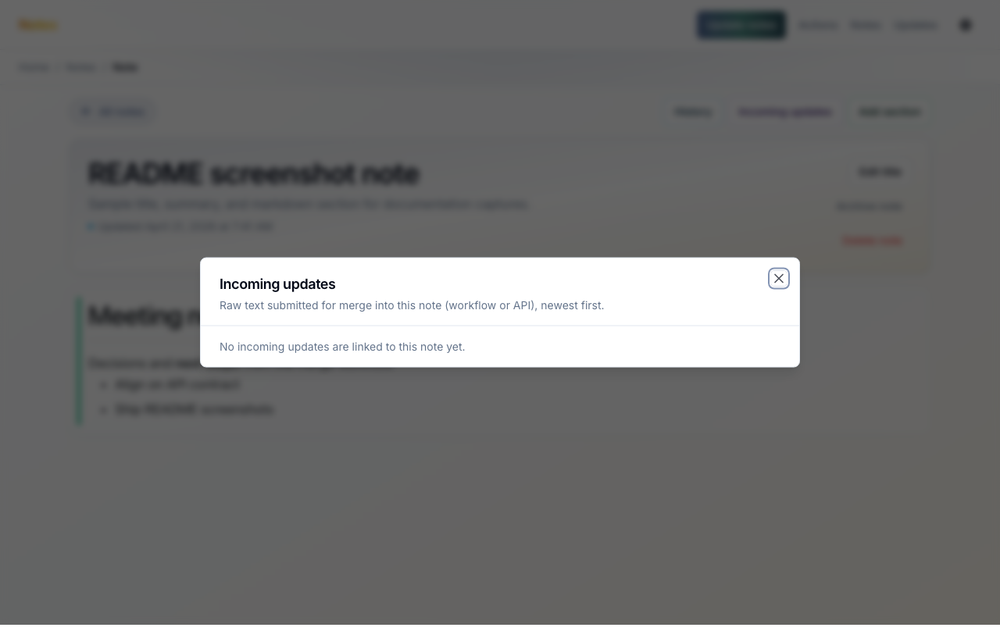
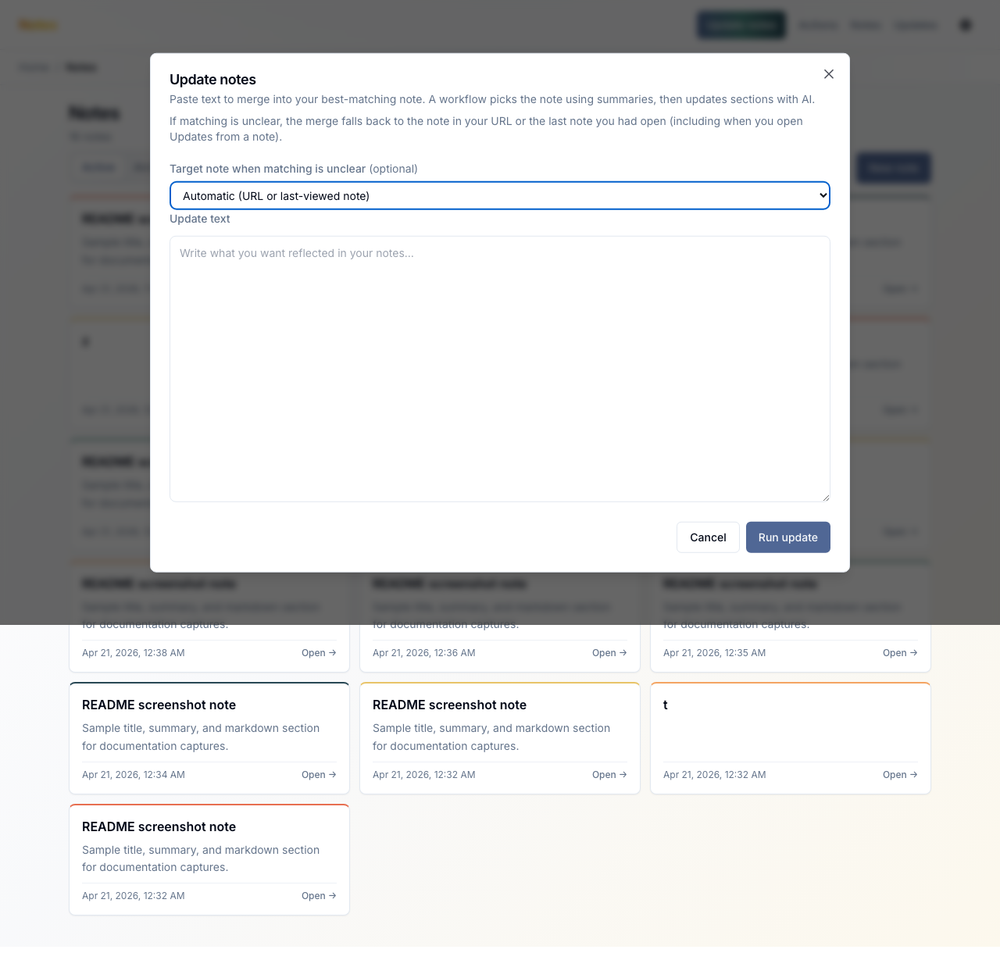
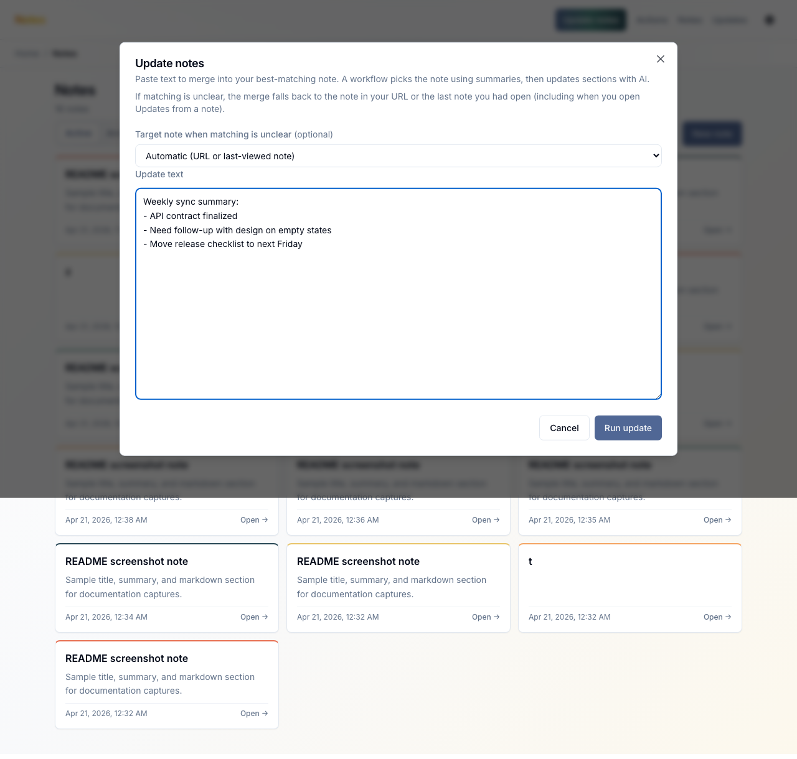
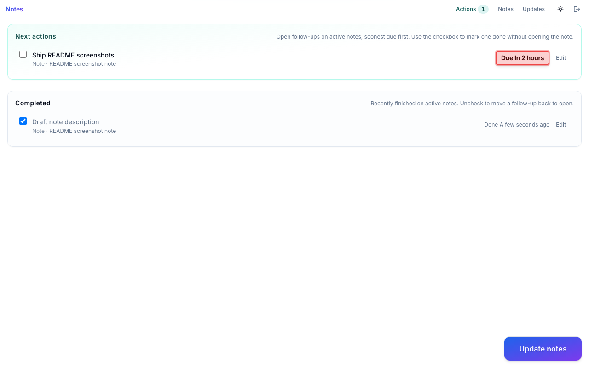
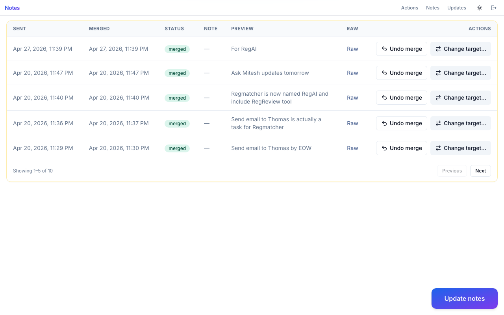

# Notes

Full-stack template with a **FastAPI** backend and a **Vite** + **React** frontend.

## About this template

This repository is a **production-style starter** for building web apps on GitLab: a typed REST API, PostgreSQL with Alembic migrations, Docker Compose for local development (Traefik routing, optional MinIO and Grafana), and a React SPA with TanStack Router and Radix-based UI. The backend follows a small **domain module layout** (models, repository, service, schemas, routes) and uses **repository-level row-level security** hooks so multi-tenant style access rules stay next to the data layer.

The frontend ships with **username and password sign-in**, a shell layout (header with **Update notes**, **Actions**, **Updates**, settings, and breadcrumbs), and **notes with drafts**: list active or archived notes, open a note with markdown sections and follow-up tasks, review **change history** and **incoming merge updates**, run the **Update notes** workflow from a modal, track follow-ups on the **Actions** page, and inspect **Sent updates** from the merge pipeline.

### How AI note updates work

The **Update notes** flow is an async workflow endpoint (`/workflow/update-notes`) that takes free-form text and applies it to your notes in the background:

1. You submit raw text from the modal (optionally with a fallback note).
2. The workflow stores that submission as an **external note update**.
3. An LLM matches the best target note using existing note titles/summaries (or fallback when matching is uncertain).
4. Another LLM pass proposes structured changes: section edits plus follow-up tasks.
5. The backend writes those changes through the normal note/chunk/task APIs, records timeline snapshots, and links the resulting rows back to the incoming update ID.
6. UI surfaces update automatically:
   - **Note detail** shows changed sections and linked incoming updates.
   - **History** shows diffs (note, section, task).
   - **Actions** shows newly created follow-up tasks.
   - **Sent updates** tracks merge status (`pending`, `merged`, `failed`, `no_match`).

This keeps the model output auditable: every generated change is tied to a source update and visible in history.

### Screenshots

These captures are produced by Playwright (`npm run screenshots:readme` in `frontend/`; see [Local Development](#local-development)). The build uses same-origin API URLs (`VITE_API_SAME_ORIGIN=1`); the test forwards `/login`, `/notes`, `/chunks`, etc. from the preview server to your Traefik backend (`README_API_URL` / `DOMAIN`, default loopback + `Host: backend.${DOMAIN}`). Repo `.env.development` supplies `DOMAIN` and first-superuser credentials when not set in the shell. Regenerate after UI changes so images stay accurate.

**Sign-in** — OAuth2-style username and password against `/login/access-token`.


**Notes** — list with Active / Archived tabs, **New note**, and **Update notes** on the index when available.



**Note detail** — title and summary, toolbar (History, Incoming updates, Add section), markdown sections, and archive/delete actions.



**Change history** — per-note timeline with line-level diffs for metadata, sections, and follow-ups.



**Incoming updates** — merge submissions linked to the note (status, body preview).



**Update notes** — modal to paste text and optionally pick a fallback note for the background merge workflow.



**Update notes example** — sample submission text before starting the workflow.



**Actions** — open and recently completed follow-ups across active notes, with quick complete / reopen.



**Sent updates** — table of updates you submitted via **Update notes**, with status and links to matched notes.



---

## **Table of Contents**

- [**About this template**](#about-this-template)
  - [Screenshots](#screenshots)
- [**⚡ Quick Start**](#quick-start)
- [**⚙️ Project Configuration**](#project-configuration)
- [**Development vs production-style Compose**](#development-vs-production-style-compose)
- [**🧱 Technology Stack and Features**](#technology-stack-and-features)
- [**🚀 Run locally**](#run-locally)
- [**💻 Local Development**](#local-development)
- [**⚗️ Database Migrations with Alembic**](#database-migrations-with-alembic)
- [**🏛️ Project Architecture**](#project-architecture)
  - [Row-Level Security (RLS)](#row-level-security-rls)
- [**🛠️ Troubleshooting Tips**](#troubleshooting-tips)

---

## Quick Start

### 1. Fork the project

Fork this template into `bootcamp/projects` folder on GitLab.

### 2. Develop locally

1. Copy `.env.development.example` to `.env.development` (or run `just init-env-dev`).
2. Run the stack:

   ```bash
   just up-dev
   # or: docker compose -f docker-compose.yml -f docker-compose.traefik.yml --env-file .env.development up
   ```

3. Open the frontend at `http://localhost`, the API docs at `http://backend.localhost/docs`, and Grafana at `http://grafana.localhost/`.


For Grafana, the username is `admin` and the password is `admin` in local.

The dashboards are automatically provisioned, **any modification from the UI will be deleted** at the next deployment. Add .json files in grafana/provisioning/dashbaords/' to add/modifiy dashboards.

---

## Project Configuration

**Important:** `.env.development` (local Docker) and `.env` (production-style Docker) contain sensitive data and should **never** be committed.

For **local development**, copy `.env.development.example` to `.env.development` and adjust values (or run `just init-env-dev` to create it if missing).

For **production-style compose** (`just up`), copy `.env.example` to `.env` and set external Postgres, S3, domains, and secrets (or run `just init-env`).

---

## Development vs production-style Compose

The repo ships **two Compose setups**. They are not “debug vs release” toggles on one file; they are different compose projects with different services and runtime behavior.

| | **Development** (`just up-dev`) | **Production-style** (`just up`) |
|--|--|--|
| **Env file** | `.env.development` (from `.env.development.example`) | `.env` (from `.env.example`) |
| **Compose files** | `docker-compose.yml` + `docker-compose.traefik.yml` | `docker-compose.prod.yml` |
| **Database** | **Postgres in Compose** (`db`), with data in a named volume; port published on the host loopback for tools | **External Postgres**; you set `POSTGRES_*` (and similar) in `.env`—no `db` service |
| **Object storage** | **MinIO in Compose** (`storage` + init), `BUCKET_URL` points at the internal service | **External S3-compatible storage**; URLs and credentials in `.env` |
| **Extra local services** | **Grafana**, `prestart` (migrations / one-off init before backend), Traefik labels from the dev overlay | **Only app images** (backend + frontend). Optional **bundled Traefik** via `just up bundled` / profile `bundled-traefik`; default expects an **external** `traefik-public` network |
| **Backend** | Source **bind-mounted** (`./backend:/app`), `uvicorn … --reload`, venv in a volume | Image-only runtime, **no** live reload |
| **Frontend** | **Vite dev server** (`npm run dev`), source bind-mounted, `NODE_ENV=development` | **`vite build` at image build**, static assets served with **`serve`**, `NODE_ENV=production`, `VITE_API_URL` passed as a **build arg** |

Use **development** for day-to-day work: everything you need (DB, bucket, metrics UI) comes up with the stack. Use **production-style** to smoke-test the same images and routing shape you run behind a real proxy and real managed Postgres/S3, without shipping a database container.

---

## Technology Stack and Features

- ⚡ [FastAPI](https://fastapi.tiangolo.com) for the Python backend API.
    - 🧰 [SQLModel](https://sqlmodel.tiangolo.com) for the Python SQL database interactions (ORM).
    - 🔍 [Pydantic](https://docs.pydantic.dev), used by FastAPI, for the data validation and settings management.
    - 💾 [PostgreSQL](https://www.postgresql.org) as the SQL database.
    - ⚗️ [Alembic](https://alembic.sqlalchemy.org/en/latest/) for managing database schema changes.
- 🚀 [Vite](https://vitejs.dev) + [React](https://react.dev) for the frontend.
    - 🧭 [TanStack Router](https://tanstack.com/router) for file-based routing (`frontend/src/routes`).
    - 💃 Using TypeScript and a modern frontend stack.
    - 🎨 [Radix UI](https://www.radix-ui.com/) for the frontend components.
- 📈 [Grafana](https://grafana.com/) for visualizing logs and metrics.
- 🐋 [Docker Compose](https://www.docker.com) for local development.
- 🏭 [Gitlab CICD](https://docs.gitlab.com/ci/) CI (continuous integration) and CD (continuous deployment).
- ⚓ [HELM](https://helm.sh/) for deployment in production (with Kubernetes).
- 📞 [Traefik](https://traefik.io) as a reverse proxy / load balancer for local development.

The platform is deployed in production on a GCP Kubernetes cluster with GC Storage buckets.

---

## Run locally

**Use when:** Developing on your laptop. Backend, frontend, Postgres, and optional services run in containers.

**Prerequisites:** Docker and Docker Compose; [just](https://just.systems/) (optional, for shortcuts).

**Config:** Copy `.env.development.example` to `.env.development` and set values for local (see [Project Configuration](#project-configuration)). All variables are for **Docker / local only** (Postgres, CORS, SSO, bucket, etc.).

**Commands:**

```bash
# Development stack (Traefik + local Postgres + MinIO)
just up-dev

# Rebuild dev images and recreate containers
just refresh-dev

# Stop dev stack (keeps volumes)
just down-dev
```

**URLs (local):** Frontend `http://localhost` · Backend API `http://backend.localhost` · API docs `http://backend.localhost/docs` · Grafana `http://grafana.localhost/`

**Notes:** DB migrations: `cd backend && uv run alembic upgrade head`.

---

## Local Development

**Note for Windows Users:** Please use Windows Subsystem for Linux (WSL) and ensure the repository is cloned into your WSL filesystem.

Everything runs in Docker. Use the [justfile](https://just.systems/) (run `just` to list all commands):

| Command | Description |
|---------|-------------|
| `just up-dev` | Start the development stack (Traefik, backend, frontend, db, storage, etc.) |
| `just refresh-dev` | Rebuild dev images and recreate containers |
| `just down-dev` | Stop the development stack (keeps named volumes) |
| `just generate-client` | Generate the frontend API client from the backend OpenAPI spec (requires backend running) |

**README screenshots:** After `just up-dev` (Traefik + API on `http://backend.${DOMAIN}`), from `frontend/` run `npm run screenshots:readme`. Optional env vars: `README_API_URL`, `README_BASE_URL`, `README_SCREENSHOT_USERNAME`, `README_SCREENSHOT_PASSWORD`, `README_SKIP_VITE=1` if you already serve the built app at `README_BASE_URL`.

### Local Service URLs

  - **Frontend:** `http://localhost`
  - **Backend API:** `http://backend.localhost`
  - **API Docs (Swagger UI):** `http://backend.localhost/docs`
  - **API Docs (ReDoc):** `http://backend.localhost/redoc`
  - **Grafana:** `http://grafana.localhost/`
  - **Traefik UI:** `http://localhost:8090`


---

## Database Migrations with Alembic

We use Alembic to manage changes to your database schema whenever you modify the SQLModel classes in `backend/app/models.py`.

### Standard Workflow

1.  **Generate a Migration Script:** In `backend/app`, run the `revision` command. Use a descriptive message.

    ```bash
    alembic revision --autogenerate -m "Add last_name column to User model"
    ```

2. **Update the script:** Inspect the generated script and modify it if necessary (e.g., to add data migrations or more precise column definitions).

3.  **Apply the Migration:** Run `cd backend && uv run alembic upgrade head`.

---

## Project Architecture

### API structure

Each folder in `backend/app/api/routes` is responsible for a specific domain (in terms of Domain-Driven Design) and contains the following files:

- `models.py`: contains the data models for the domain. This represents the data stored in the database. This is where the SQLAlchemy (through SQLModel) models are defined.
- `repository.py`: contains the repository pattern for the domain. This represents the data access layer. This is where the business logic interacts with the database. All the SQL queries are written here. Also, the permissions are managed here at the database layer level.
- `service.py`: contains the business logic for the domain. This represents the application layer and is where the business rules are implemented. Services are created as classes that should contains 1 method per route.
- `schemas.py`: contains the Pydantic (through SQLModel) schemas for the domain. This represents the data that is sent and received from the API. This is where the contract between the client and the server is defined.
- `routes.py`: contains the API routes for the domain. This represents the presentation layer and is where the API endpoints are defined. This is where the FastAPI routers are defined. Routes should only call the service methods and return the result. They should not contain any business logic or SQL queries.
- `utils.py`: contains the utility functions for the domain. This represents the shared layer and is where the common functions are defined. If you need to share functions between different domains, you should put them in a root-level `utils.py` file.

### Row-Level Security (RLS)

Permissions are enforced at the **repository layer** via RLS. Each repository that extends `BaseRepository` defines four callables: `rls_select`, `rls_insert`, `rls_update`, `rls_delete`. Each receives the current user's ID and returns a SQLAlchemy expression (or `True`/`False`) that restricts which rows the user can access.

| Hook | When applied | Purpose |
|------|--------------|---------|
| `rls_select` | `read_by_id`, `list`, `count` | Filter rows the user can read |
| `rls_insert` | `create`, `create_by_batch` | Restrict which rows the user can insert |
| `rls_update` | `update` | Restrict which rows the user can update |
| `rls_delete` | `delete` | Restrict which rows the user can delete |

**Rules:**

- **Superuser bypass:** If `current_user.is_superuser` is true, RLS is skipped for that operation.
- **Default:** If not overridden, each hook defaults to `False` (no access).
- **`bypass_rls`:** Repository methods accept `bypass_rls=True` for internal/system flows (e.g. login, workflows) that must access data regardless of the current user.

**Examples:**

- **User repository:** `rls_select` returns `True` (all users visible); `rls_update` returns `User.id == user_id` (users can only update their own row).
- **Run repository:** `rls_select` returns `Run.creator_id == user_id` (users see only their runs); `rls_insert` returns `True` (anyone can create); `rls_delete` returns `False` (no one can delete).
- **RunStep repository:** `rls_select` returns `RunStep.run.has(Run.creator_id == user_id)` (access via parent relation).

For actions that span multiple resources or need custom logic (e.g. workspace membership), the **service layer** loads the resource, checks permissions, and raises 403 if not allowed.

To create a new endpoint following this structure, you can use the script `backend/scripts/new_table.py`, for example:
```bash
python3 backend/scripts/new_table.py --tablename "requirement_match" --classname "RequirementMatch" --classname_plural "RequirementMatches" --tagname "Requirement Match" --docname "requirement match" --docname_plural "requirement matches" --funcname "requirementmatch" --funcname_plural "requirementmatches"
```

---

## Troubleshooting Tips

Here are solutions to common development roadblocks:

* **Line Ending Issues (`\r` errors):** Files from Windows (especially on WSL) often have extra characters.
    * **Fix:** Run `dos2unix your_file.env` (install with `sudo apt install dos2unix`) or `sed -i 's/\r$//' your_file.env`. In VS Code, set line endings to **"LF"** in the status bar.

* **Port Conflicts:** "Address already in use" errors mean something else is using a port.
    * **Fix:** Stop conflicting containers (`just stop`) or identify and kill the process on your host.

* **Service Won't Start:** If your entire setup is stuck.
    * **Fix:** Try starting services one at a time (e.g., `docker compose --env-file .env.development -f docker-compose.yml -f docker-compose.traefik.yml up backend`) to isolate the problem. Check container logs with `docker compose ... logs <service-name>`.
